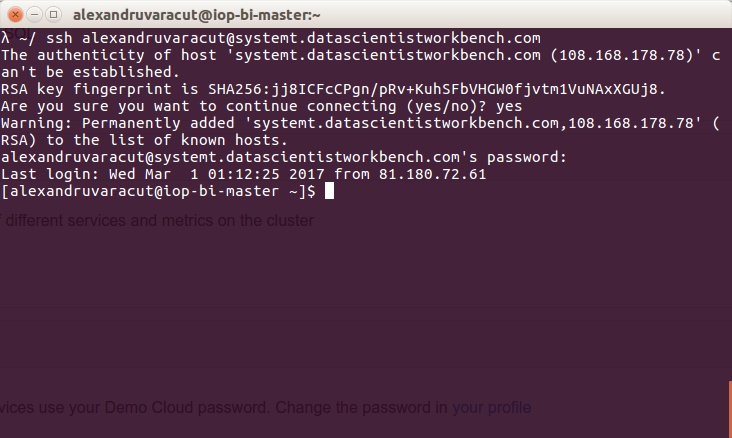
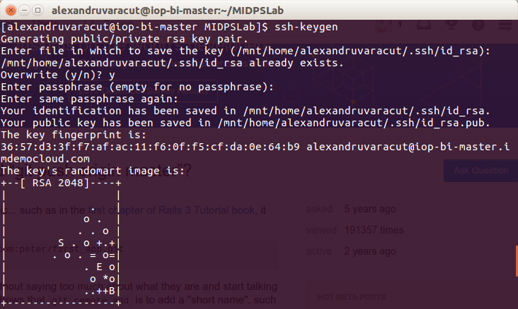
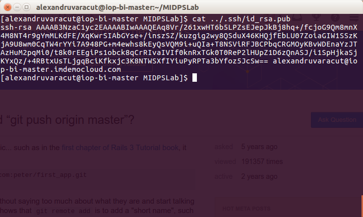
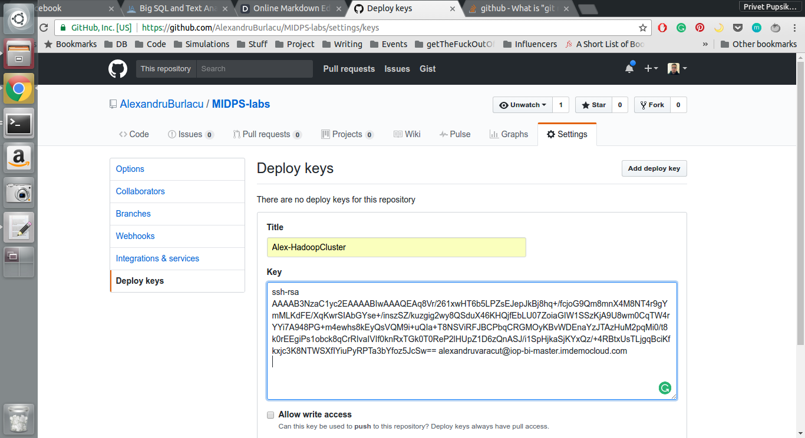
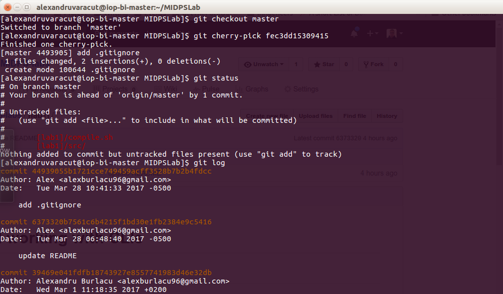
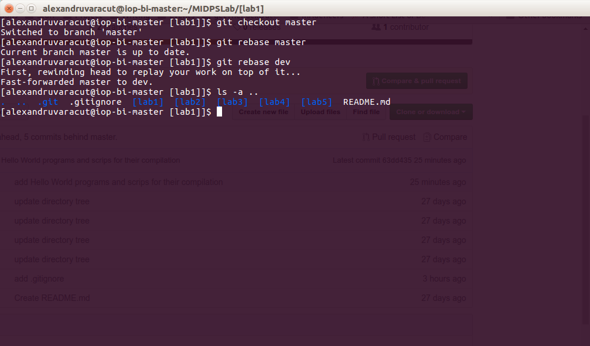

# VCS and working with CLIs

## Intro
For this laboratory work we will do the following:
- Connect to it via ssh to a remote server, namely to a Hadoop cluster provided by IBM
- Generate an ssh public key and add it to the GitHub project
- Work with git

The prerequisites are:
- The cluster, from [here](https://my.imdemocloud.com)
- Git
- some compilers and interpreters (gcc, g++, python, maybe something else) that are already there

## Act 1: Connect via SSH

Here everything is pretty simple: first we need an account on my.imdemocloud.com `>>=` get the credentials `>>=` type on our local machine the command `ssh <username>@systemt.datascientistworkbench.com` where _username_ is the name given by IBM for your account  `>>=` you are done, congrats!



[NOTE] `>>=` is the __bind__ operator in Haskell language that is used with Monads.
To make it less geeky, it's equivalent to `.then` for JavaScript Promises.

## Act 2: The mighty Git
First of all we have to install git `sudo apt-get install git`
Configure global user name `git config --global user.name "Alex"`
Configure global user email `git config --global user.email "alexburlacu96@gmail.com"`
To initialize a directory you must run `git init`.
Or you can clone an existing one `git clone <git@github.com:AlexandruBurlacu/MIDPS-labs.git>`, for example.
To make it track a remote repository `git remote add origin git@github.com:AlexandruBurlacu/MIDPS-labs.git`.
It is handy to to set the remote repo as the default destination for pushes from local, for this run `git push -u origin <remote_branch_name>`
To add a public RSA key there:
- generate a key with ssh-keygen  
- copy and add it into the remote repository 

To merge in the actual branch a single commit from another branch use `git cherry-pick <commit_from_another_branch SHA1>` 
To switch between branches run `git checkout <branch_name>`
To rollback a commit we have several solutions:
- `git checkout <commit SHA1>`
- `git reset HEAD` if you don't want the changes to be purged from the branch
- `gir reset --hard HEAD` if you DO want commited changes to be purged
- `git revert` rollbacks by 1 commit

Also there's `git rebase <branch_name>` which in some sense places one branch atop another, this way preserving commit history of both. 

And finally, `git merge`, the cause of so many memes, it is actually a way to join branches, for example to join a new module which offers some special functionality, and the master branch.


## Act 3: Running the app remotely

For this laboratory work we will write, compile and run a ~~MapReduce job~~ some Hello World programs on a Hadoop cluster with 32 physical cores and 256 GB of RAM. ~~Sounds good, doesn't it?~~ I know, it sounds incredibly awful, I will explain during the next laboratory work how such thing happend.

So, we created some bash scripts that firs compile, then run the hello world programs written in C and Java, and then these scripts purge unwanted files like `.class` or executables.

Also, we have written a small bash script that given the file name will run the appropriate script to compile and run it.
The code:
```bash
#!/bin/bash

for i in "$@"
do
case $i in
  *.java)
  source compile_and_run_java >&1
  shift
  ;;
  *.c)
  source compile_and_run_c >&1
  shift
  ;;
esac
done
```

## Conclusion
First of all, Git is awesome! Second, Java is sh*t (no offense), I was trying to make a simple WordCount program run for more than 2 hours, the code was from damn Hadoop official page!!! Anyway. Third, VCS is a very important tool for serious software development, even if you code alone, it helps to organize your codebase, to test new modules/features/whatever without breaking everything, and most important, even if you are so silly that you've done some awful stuff, you can always rollback.
